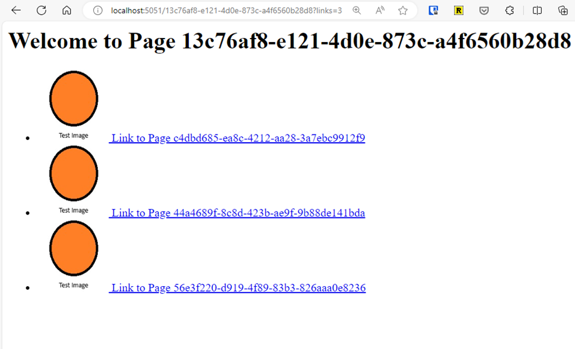

# Asynchronous Processing in .NET - Asynchronous Concurrent WebScrapers

## Overview
This repository contains a demonstration of a translating web scraping application that uses various concurrency models of asynchronous processing to teach different approaches in .NET. The application supports multiple scrapers, each implementing a different concurrency model, along with several translators. The scrapers can be configured to scrape a specified URL, with options for maximum depth, translation language, and whether to stay within the domain.

## Solution Structure
The solution consists of several projects, each serving a specific purpose:
1. **WebScraper.Concurrency**: The main project containing the web scrapers, translators, and core logic for scraping web pages using different concurrency models
2. **WebScraper.Benchmark**: A benchmarking project using BenchmarkDotNet to compare scraper performance
3. **AsyncProcessingSamples.AppHost**: An Aspire project for managing and running the web scraping application
4. **InfiniteDepthWebSite**: A mock project simulating a website with infinite depth for testing

## WebScraper.Concurrency

### Scrapers
Available scrapers include:
- **NaiveWebScraper**: Simple scraper with no concurrency
- **AllTasksWebScraper**: Uses Task.WhenAll for concurrent execution
- **BlockingCollectionWebScraper**: Implements BlockingCollection for concurrent task management
- **ChannelsBasedWebScraper**: Utilizes channels for concurrency
- **TplDataflowWebScraper**: Leverages TPL Dataflow for concurrent processing

### Translators
- **LibreTranslateTranslator**: Provider for [LibreTranslate](https://github.com/LibreTranslate/LibreTranslate) service
- **AzureAIDocumentTranslator**: Provider for Azure AI [document translation service](https://learn.microsoft.com/en-us/azure/ai-services/translator/document-translation/overview)
- **AzureAITextTranslator**: Provider for Azure AI [text translation service](https://learn.microsoft.com/en-us/azure/ai-services/translator/text-translation-overview)
- **DummyTranslator**: Mock translator with 100ms delay that returns original text

### Configuration

#### Configuration File
Create an `appsettings.json` file in the project root:

```json
{
  "AzureTranslationService": {
    "subscriptionKey": "your_subscription_key",
    "textendpoint": "your_text_translation_endpoint",
    "documentendpoint": "your_text_document_endpoint",
    "region": "your_region"
  },
  "LibreTranslate": {
    "BaseUrl": "your_LibreTranslate_url (e.g http://localhost:5000)"
  }
}
```

#### User Secrets
Alternatively, use user secrets:

```bash
# Initialize user secrets
dotnet user-secrets init

# Set individual secrets
dotnet user-secrets set "AzureTranslationService:subscriptionKey" "your_subscription_key"
dotnet user-secrets set "AzureTranslationService:textendpoint" "your_text_translation_endpoint"
dotnet user-secrets set "AzureTranslationService:documentendpoint" "your_text_document_endpoint"
dotnet user-secrets set "AzureTranslationService:region" "your_region"
dotnet user-secrets set "LibreTranslate:BaseUrl" "your_LibreTranslate_url"
```

#### Usage

#### Running the Application
Use the following command format:
```bash
dotnet run <url> <scrapers> <maxDepth> <translateToLanguage> <stayInDomain>
```

Parameters:
- **url**: Target URL to scrape
- **scrapers**: Comma-separated list of scrapers (e.g., naive,alltasks,channelsbased)
- **maxDepth**: Maximum scraping depth
- **translateToLanguage**: Target translation language
- **stayInDomain**: Boolean flag to stay within domain

Example:
```bash
dotnet run https://dotnet.microsoft.com/en-us/ naive,alltasks,channelsbased 1 he true
```

### Project Structure

- **WebScraper.Concurrency**: Main application and scrapers
- **WebScraper.Concurrency/Scrapers**: Scraper implementations
- **WebScraper.Concurrency/Translators**: Translator implementations

### Adding a New Scraper
1. Create a new class in `WebScraper.Concurrency/Scrapers` inheriting from `BaseWebScraper`
2. Implement the `ScrapeAsync` method
3. Register the scraper in `Program.cs` (`ConfigureServices` method)
4. Add the scraper to the `ScraperType` enum


### WebScraper.Benchmark
The repository includes a BenchmarkDotNet-based project for comparing scraper performance. Results are displayed in the console and saved to a file.

### AsyncProcessingSamples.AppHost - Aspire Project
An Aspire project is included for application management. It launches both the InfiniteDepthWebSite and WebScraper.Concurrency projects, configuring the scraper to target the test website.

### InfiniteDepthWebSite Project
A mock website project generating infinite-depth content for scraper testing. Pages contain links to other pages with unique GUIDs. The number of links per page can be controlled via the 'links' query parameter.
